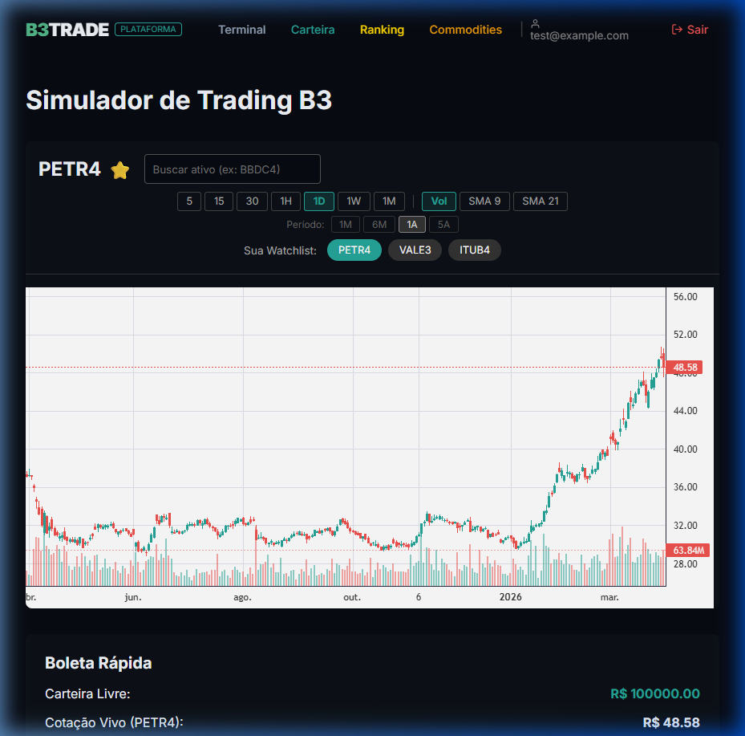
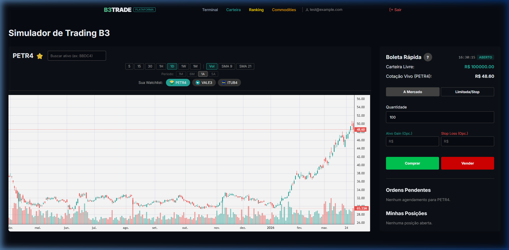
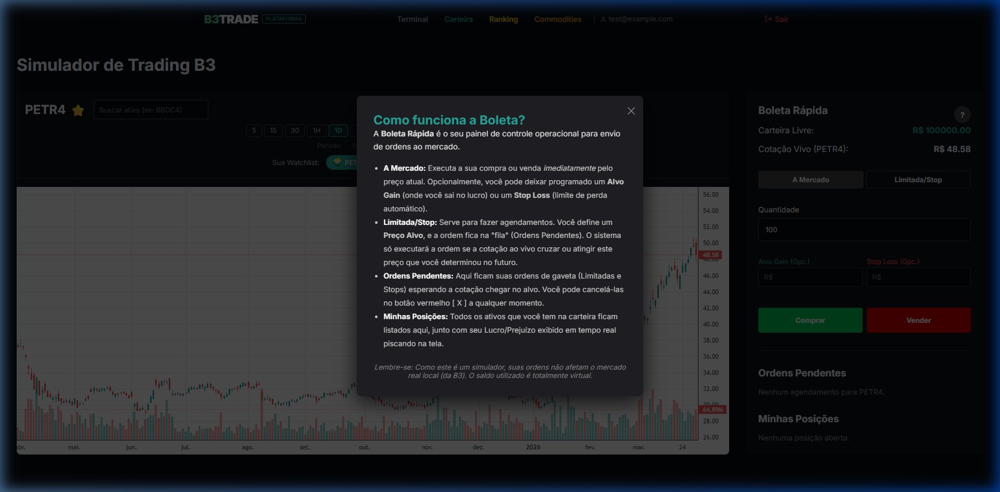

# Simulador B3Trade & Home Broker

O **B3Trade** é um ambiente completo de simulação financeira projetado para entregar uma experiência de *"Home Broker"* e monitoramento de mercado com dados quase em tempo real (dados com delay de terceiros, mas arquitetura de alta frequência local).



## 🌟 Principais Features (Recentemente Implementadas)

### 1. Dashboard de Commodities Globais
Os usuários podem monitorar os preços de 15 commodities mundiais cruciais diretamente na plataforma (na aba "Commodities").
*   📊 **Feed do Yahoo Finance:** Desenvolvemos a rota `/api/commodity` que consome dados diretos dos contratos futuros.
*   🏷 **Categorias Inteligentes:** Os ativos foram separados em Energia (ex: Petróleo, Gás), Metais (ex: Ouro, Ouro) e Agrícolas (ex: Soja, Milho de Chicago).
*   💵 Faturados em **USD** para corresponder ao mercado internacional.

### 2. In-Memory Server Cache (Proteção Anti Rate-Limit)
Como o simulador e o dashboard precisam se atualizar muito rápido, implementamos uma barreira arquitetural de cache no backend Node.js (`/api/quote` e `/api/commodity`).
*   **Velocidade e Resiliência:** A API salva o dado na memória RAM do servidor. Toda visita na tela bate na memória a cada segundo (0ms de latência). Por trás, a API só se comunica com o Yahoo a cada 30 segundos (TTL).

### 3. Avanços na Boleta Rápida (Simulador)
A área de negociação ficou mais robusta, esteticamente agradável e segura contra operações erradas.

#### Logos na Watchlist
Os botões de "Sua Watchlist" carregam os SVGs nativos das companhias, entregando uma identidade visual visual premium à sessão de trading.

#### Relógio Sincronizado com a B3 🕒
O simulador entende o horário de funcionamento dos pregões brasileiros.



*   🟢 **ABERTO** (Entre 10h e 17h55)
*   🟠 **FECHANDO** (Entre 17h55 e 17h59)
*   🔴 **FECHADO** (Finais de Semana ou Noite). As operações sofrem _lock_ completo nos botões de Comprar e Vender.

#### Modal de Ajuda Interativo
Ao abrir a interrogação da Boleta de Ordens, um modal explica o funcionamento da plataforma para traders novatos.



---

## 🛠 Como executar o projeto localmente

```bash
# 1. Instale as dependências
npm install

# 2. Rode o servidor de dev
npm run dev
```

Abra [http://localhost:3000](http://localhost:3000) com o seu browser para acessar a plataforma.
O simulador de trading estará na rota `/simulator`. As commodities na rota `/commodities`.
